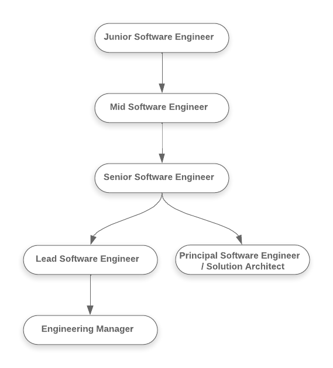

# Axis Engineering Career Framework

## Overview
The Axis Engineering Career Framework serves as a comprehensive guide for individual growth and career progression within our organization. This framework outlines competencies, responsibilities, and expectations at each career level, empowering engineers on their professional journey.

---

### Software Engineer I - Junior

- **Scope of Influence:**
  - Individual tasks within a project

- **Building:**
  - Learning and actively being developed by others

- **Executing:**
  - Developing knowledge of a single component of our architecture
  - Thoroughly tests new code, both locally and in production once shipped

- **Leadership:**
  - Takes ownership of learning and shows initiative
  - Accepts and integrates constructive feedback effectively

- **Example:**
  - Implemented a new feature with guidance from senior team members
  - Collaborated with the team to resolve a bug promptly

- **Career Path:**
    - Software Engineer I -> Software Engineer II
    
- **Growth Deadline:**
    - Expected to reach Software Engineer II level within 12-18 months

- **Checklist:**
    * **Technical Skills:**
        - [ ] Demonstrates proficiency in the primary programming language and relevant technologies.
        - [ ] Effectively implements solutions based on provided specifications.
        - [ ] Writes clear and maintainable code.
        - [ ] Collaborates with the team to resolve basic technical challenges.

    * **Learning and Adaptability:**
        - [ ] Actively seeks guidance and mentoring to enhance skills.
        - [ ] Shows initiative in learning new technologies and tools.
        - [ ] Responds positively to feedback and applies it to improve performance.

    * **Team Collaboration:**
        - [ ] Works well within the team, contributing to a positive team culture.
        - [ ] Communicates effectively and asks for help when needed.
        - [ ] Participates in team discussions and contributes ideas.

    * **Delivering Results:**
        - [ ] Completes well-scoped individual tasks effectively.
        - [ ] Tests code thoroughly, catching bugs before they reach production.
        - [ ] Takes ownership of work and shares feedback for improvement.

---

### Software Engineer II - Midlevel
- **Scope of Influence:**
  - A project overall within a team/area
- **Building:**
  - Self-sufficient in the primary area of work, contributing to the project as a whole
- **Executing:**
  - Debugs effectively within their primary area to help find the root cause
  - Owns small-to-medium features from technical design through completion
- **Leadership:**
  - Works in parallel with peers, building a stronger team through effective collaboration
  - Gives helpful and timely feedback to managers and peers
- **Example:**
  - Independently implemented a new module within the project
  - Assisted junior team members in understanding complex technical issues

- **Career Path:**
    - Software Engineer II -> Senior Engineer
- **Growth Deadline:**
    - Expected to reach Senior Engineer level within 18-24 months

- **Checklist:**
    * **Technical Skills:**
        - [ ] Self-sufficient in the primary area of work, contributing to the project as a whole.
        - [ ] Debugs effectively within their primary area to find root causes.
        - [ ] Owns small-to-medium features from technical design through completion.

    * **Leadership and Ownership:**
        - [ ] Demonstrates an ownership mindset, challenging the status quo when needed.
        - [ ] Proactively identifies and addresses technical challenges without direct guidance.
        - [ ] Provides meaningful input during technical discussions within the team.

    * **Collaboration and Mentorship:**
        - [ ] Collaborates effectively with peers, building a stronger team.
        - [ ] Seeks input from teammates and helps others achieve their goals.
        - [ ] Actively mentors and shares knowledge with junior team members.

    * **Project Management:**
        - [ ] Manages time effectively, delivering smaller projects within deadlines.
        - [ ] Engages with product management on feasibility and clarifies requirements.
        - [ ] Keeps stakeholders informed of progress and blockers.

---

### Senior Engineer
- **Scope of Influence:**
  - A larger project overall within a team/area
- **Building:**
  - Self-sufficient in at least one large area of the codebase with a high-level understanding of other components
- **Executing:**
  - Contributes to the foundational good of their domain and engineering overall
  - Proactively develops a stronger team
- **Leadership:**
  - Acts as a primary maintainer for existing critical systems
  - Implements complex features with a large product surface area
  - Guides and mentors junior engineers
- **Example:**
  - Led the successful completion of a major project within the team
  - Conducted knowledge-sharing sessions to elevate team members' skills

- **Career Path:**
   - Senior Engineer -> Lead Engineer
   - Senior Engineer -> Principal Engineer
   - Senior Engineer -> Staff Engineer

- **Growth Deadline:**
    - Expected to reach next level within 24-30 months

- **Checklist:**
    * **Technical Skills:**
        - [ ] Self-sufficient in at least one large area of the codebase with a high-level understanding of other components.
        - [ ] Contributes to the foundational good of their domain and engineering overall.
        - [ ] Consistently delivers projects through a small team, making meaningful progress.

    * **Leadership and Ownership:**
        - [ ] Demonstrates maturity in decision-making and code design choices.
        - [ ] Proactively identifies and addresses risks in projects.
        - [ ] Actively contributes to defining patterns and canonical examples.

    * **Collaboration and Mentorship:**
        - [ ] Proactively seeks input from teammates and helps them achieve their goals.
        - [ ] Guides and mentors junior engineers, providing constructive feedback.
        - [ ] Engages in productive dialog with conflicting views, both inside and outside the team.

    * **Project Management:**
        - [ ] Scopes out work methodically, based on iterative learning.
        - [ ] Sets realistic deadlines and prioritizes in alignment with company goals.
        - [ ] Actively contributes to defining patterns and canonical examples.

---

### Staff Engineer
- **Scope of Influence:**
  - Multiple projects and possibly across teams
- **Building:**
  - Drives technical excellence and innovation across the organization
- **Executing:**
  - Leads and contributes to strategic technical initiatives
  - Provides expertise and guidance on critical technical decisions
- **Leadership:**
  - Recognized as a technical authority within the organization
  - Mentors senior and junior engineers
  - Collaborates with leadership to shape technical strategy
- **Example:**
  - Led the implementation of a company-wide technical standard
  - Mentored multiple engineers, significantly elevating team capabilities

- **Career Path:**
   - Staff Engineer -> Principal Engineer
   - Staff Engineer -> Engineering Manager
   - Staff Engineer -> Solution Architect

- **Growth Deadline:**
   - Expected to choose a career path (Principal Engineer, Engineering Manager, Solution Architect) within 24-30 months

- **Checklist:**
    * **Technical Skills:**
        - [ ] Drives technical excellence and innovation across the organization.
        - [ ] Leads and contributes to strategic technical initiatives.
        - [ ] Provides expertise and guidance on critical technical decisions.

    * **Leadership and Ownership:**
        - [ ] Recognized as a technical authority within the organization.
        - [ ] Mentors senior and junior engineers.
        - [ ] Collaborates with leadership to shape technical strategy.

    * **Collaboration and Mentorship:**
        - [ ] Leads by example, fostering collaboration and innovation.
        - [ ] Mentors multiple engineers, significantly elevating team capabilities.
        - [ ] Collaborates with cross-functional teams to drive organizational success.

    * **Project Management:**
        - [ ] Manages and contributes to strategic technical initiatives.
        - [ ] Sets and influences technical standards across multiple projects.
        - [ ] Collaborates with leadership to align technical goals with business objectives.

---

### Lead Engineer
- **Scope of Influence:**
  - Whole team/product area
- **Building:**
  - Gives guidance & unblocks others on their team/area
  - Acts as a resource to unblock and enable teams across various projects
- **Executing:**
  - Effectively delivers projects through a large team or with significant complexity
- **Leadership:**
  - Sought out by others as a technical resource
  - Makes others better through effective mentoring and code reviews
  - Collaborates with cross-functional teams to achieve product goals
- **Example:**
  - Successfully led a cross-functional project with positive outcomes
  - Mentored team members to improve their technical and soft skills

- **Career Path:**
   - Lead Engineer -> Engineering Manager
   - Lead Engineer -> Principal Engineer
   - Lead Engineer -> Solution Architect

- **Growth Deadline:**
   - Expected to choose a career path (Engineering Manager, Principal Engineer, Solution Architect) within 24-30 months

- **Checklist:**
    * **Technical Skills:**
        - [ ] Effectively delivers projects through a large team or with significant complexity.
        - [ ] Acts as a primary maintainer for existing critical systems.
        - [ ] Provides guidance and unblocks others on their team/area.

    * **Leadership and Ownership:**
        - [ ] Demonstrates strong leadership for the whole team/product area.
        - [ ] Recognized as a technical resource and mentor within the organization.
        - [ ] Collaborates with cross-functional teams and aligns technical goals with business objectives.

    * **Collaboration and Mentorship:**
        - [ ] Sought out by others as a technical resource.
        - [ ] Makes others better through effective mentoring, pairing, and code reviews.
        - [ ] Collaborates with peers and cross-functional teams to achieve common goals.

    * **Project Management:**
        - [ ] Effectively delivers projects through a large team or with significant complexity.
        - [ ] Prioritizes backlog and tackles tech debt proactively.
        - [ ] Maintains a balance between pragmatism and polish.

---

### Engineering Manager
- **Scope of Influence:**
  - Multiple teams or a department
- **Building:**
  - Guides and mentors engineering teams to enhance their capabilities
- **Executing:**
  - Manages and prioritizes team deliverables
  - Collaborates with product managers to align engineering goals with business objectives
- **Leadership:**
  - Responsible for the overall performance and career growth of the engineering team
  - Builds and fosters a positive team culture
  - Collaborates with other managers to drive organizational success
- **Example:**
  - Successfully managed the delivery of multiple projects within the department
  - Conducted regular one-on-one sessions to support the professional development of team members

- **Career Path:**
   - Engineering Manager -> Senior Engineering Manager
   - Engineering Manager -> Director of Engineering
   - Engineering Manager -> Head of Engineering

---

### Solution Architect
- **Scope of Influence:**
  - Cross-functional projects, architecture planning
- **Building:**
  - Designs and architects complex, scalable, and reusable systems
- **Executing:**
  - Leads the evaluation and adoption of new technologies
  - Collaborates with engineering teams to ensure architectural alignment
- **Leadership:**
  - Defines and drives the strategic vision for technology and architecture
  - Acts as a technical advisor to senior leadership
  - Ensures the overall health and coherence of the technical landscape
- **Example:**
  - Architected a scalable microservices-based solution for a critical business module
  - Led the adoption of a new technology, resulting in improved system performance

- **Career Path:**
    - Solution Architect -> Senior Solution Architect
    - Solution Architect -> Director of Engineering
    - Solution Architect -> Head of Engineering

---

### Principal Engineer
- **Scope of Influence:**
  - Entire Organization
- **Building:**
  - Acts as a resource to unblock and enable teams across the organization
- **Executing:**
  - Manages Buffer-wide initiatives
- **Leadership:**
  - Routinely and consistently pushes the entire organization forward
  - Sets strategic foundational direction for Buffer
  - Collaborates with leadership to drive organizational success
- **Example:**
  - Led the successful execution of a company-wide technical initiative
  - Collaborated with senior leadership to define the long-term technical vision for the organization

- **Career Path:**
  - Principal Engineer -> Director of Engineering
  - Principal Engineer -> Head of Engineering

---

## Notes:

- **Lead Engineer:** At the Lead Engineer level, individuals can choose to transition into an Engineering Manager role, a Principal Engineer role, a Solution Architect role, or continue to grow as a Lead Engineer, depending on their career aspirations and strengths.

- **Engineering Manager:** The Engineering Manager role can further progress to a Principal Engineer role, a Solution Architect role, or continue to lead engineering teams, providing a triple path for individuals who excel in leadership, technical expertise, or solution architecture.

- **Principal Engineer:** At the Principal Engineer level, individuals can choose a leadership path, a technical fellow path, or transition to a Solution Architect role, based on their preferences and strengths.

- **Solution Architect:** The Solution Architect role provides a dedicated career path for individuals who specialize in architectural planning and design, offering opportunities for both technical and leadership growth.

- **Staff Engineer:** Introducing the Staff Engineer role, bridging the gap between Senior Engineer and Lead Engineer levels, focusing on technical excellence, leadership, and mentorship across multiple projects and teams.
